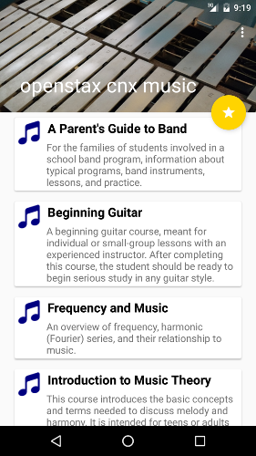

# OpenStaxCNXMusic
Android app highlighting CNX Music textbooks

Users can
 - read music textbooks from OpenStax CNX
 - create bookmarks
 - share with others

App also remembers where you left off when reading

Icons used in App
==================
The music icons used in the app were created by icons8.com and are licenced Creative Commons Attribution-NoDerivs 3.0 Unported.
 - **Tuba:** http://www.iconsplace.com/turquoise-icons/tuba-icon
 - **Xylophone:** http://www.iconsplace.com/purple-icons/xylophone-icon
 - **Note:** http://www.iconsplace.com/navy-icons/note-icon
 - **Treble Clef:** http://www.iconsplace.com/navy-icons/treble-clef-icon

License
=======
This software is subject to the provisions of the GNU Lesser General Public License Version 2.1 (LGPL). See license.txt for details. Copyright (c) 2016 Rice University
